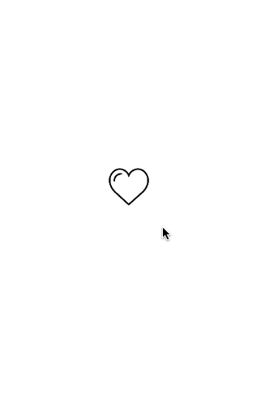
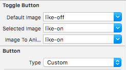

# SHToggleButton
A toggle button with a cool animaiton.

## Overview

## How to use

1- Drag a UIButton object and set it's custom class to SHToggleButton.

2- Make sure that you change button type to *Custom*

3- Select Default, Selected image and Image to animate.

## Installation

Just include  *SHToggleButton.swift*  in your project.

## Demo

Download and run the project.

## License

This project is licensed under the MIT License - see the [LICENSE.md](LICENSE) file for details

